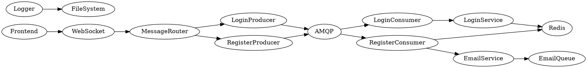

# 🔐 Distributed Login System with Fastify + Redis + AMQP + WebSocket


> Secure, fast, modular. Just like it should be. You want login? You want security? You want firepower? Boom. You're in the right repo.

A secure, asynchronous login architecture built with **Fastify**, **Redis**, **RabbitMQ**, and **WebSocket**, ideal for SaaS and fintech beasts. Fully decoupled and real-time ready. Authentication via queues. Response via WebSocket. It screams PERFORMANCE. 💥

---

## 📊 Architecture Overview

```
Frontend (React)
   ↓ WebSocket
Backend (Fastify) → Redis + AMQP → Consumers → Email + Auth Service → Response (WebSocket)
```

---

## 📦 Project Structure

```
login-auth/
├── app.js
├── app/
│   ├── producers/        # Where the magic starts
│   └── consumers/        # Where the magic completes
├── services/             # The underworld
│   ├── wss/              # WebSocket logic
│   ├── loginService/     # Auth logic
│   ├── redis/            # Redis cache layer
│   ├── mail/             # Email queuing & dispatch
│   └── amqp/             # Queue handling
├── logger/               # Custom logger, Winston-based
├── routes/               # Express routes
├── finthenticate/        # Frontend (React)
```

---

## 🚀 Technologies Used

- Node.js + Fastify
- React
- Redis
- RabbitMQ
- WebSocket
- LRU Cache
- Winston Logger
- Email Queue System

---

## 🔄 System Workflow

1. 🧠 User sends login/register data via WebSocket
2. 🚀 Message is routed to a Producer
3. 📮 Producer publishes it to RabbitMQ
4. 🧾 Consumer picks it up, validates, hashes, stores
5. 📬 Sends email confirmation or response
6. 🧵 WebSocket notifies frontend instantly

---

## 🔧 Run the Monster

```bash
cd login-auth
chmod +x setup.sh
./setup.sh
```

You might want to run Redis and RabbitMQ via Docker. Or spin your own servers. You’re the boss.

---

## 🧩 Core Logic Explained

- `wss-server.js` → WebSocket entry point
- `loginService` → Handles login logic: hashing, token, validation
- `redis.js` → Fast, simple, blazing cache
- `amqp.js` → Queue ops: connect, publish, consume
- `email_service.js` → Handles all email sending in background
- `producers/` → Fire and forget auth requests
- `consumers/` → Heavy lifters that do the dirty job

---

## 📊 Dependency Graph (DOT)



---

## 🌐 License

MIT. Do whatever you want. But don’t be evil. Or slow. Or both.

---

## ⚡ Final Word

> If this project helps you save time, close deals, get users or sleep better...  
> Drop a ⭐ and share it with someone building the next big thing.  

**Built by a man with a vision, not a team with a Jira board.**

