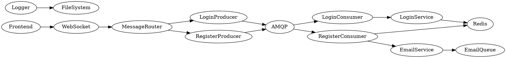

# 🔐 Distributed Login System with Fastify + Redis + AMQP + WebSocket


A secure, asynchronous login architecture built with **Fastify**, **Redis**, **RabbitMQ**, and **WebSocket**, ideal for SaaS and fintech applications. The system is fully decoupled and real-time ready, processing authentication via message queues and responding to clients using WebSocket.

---

## 📊 Architecture Overview

```

# 🛡️ Login/Auth WaaS - Modular Authentication System

This project is a complete authentication system with an event-driven microservices architecture, using WebSocket, AMQP, Redis, and React frontend. It can be used as "Auth as a Service" (WaaS).

---

## 📦 Project Structure

```
login-auth/
├── app.js
├── app/
│   ├── producers/
│   │   ├── register/
│   │   └── login/
│   └── consumers/
│       ├── register/
│       └── login/
├── services/
│   ├── wss/
│   ├── loginService/
│   ├── mail/
│   ├── redis/
│   └── amqp/
├── logger/
├── routes/
├── finthenticate/  # React Frontend
```

---

## 🚀 Technologies Used

- Node.js
- Express
- Redis
- RabbitMQ (AMQP)
- WebSocket
- React
- LRU Cache
- Winston Logger
- Email Queue

---

## 🔄 System Workflow

1. **User accesses the frontend (React)**
2. **Frontend connects via WebSocket to the `wss-server`**
3. **Sends login or registration data to a Producer**
4. **Producer sends the data to a RabbitMQ queue**
5. **Consumer listens to the queue and processes the data**
6. **Consumer interacts with Redis, authentication, email, etc.**
7. **Response is sent back to the user's WebSocket**

---

## 🔧 How to Run the Project

```bash
# Backend
cd login-auth
npm install
node app.js

# Frontend
cd finthenticate
npm install
npm start
```

---

## 📌 Key Components Explained

- `services/wss/`: WebSocket server with message routing
- `services/loginService/`: Login logic (password hashing, validation)
- `services/mail/`: Background email service with queue
- `services/redis/`: Redis connection and caching
- `services/amqp/`: RabbitMQ communication
- `producers/`: Send messages to the queue
- `consumers/`: Listen to the queue and handle heavy logic

---

## 📊 Dependency Diagram (DOT)



This graph shows the message flow from frontend to the core services.

---

## 🧪 Tests

```bash
npm test
```

---

## 📫 Contact

WaaS Project - Auth & Login. Developed by ME .

---


> If you like this project, give it a ⭐ and share it!

---

## 📝 License
ISC
